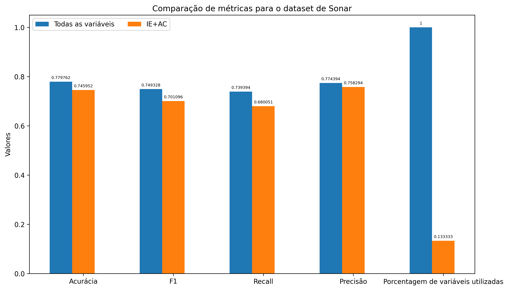
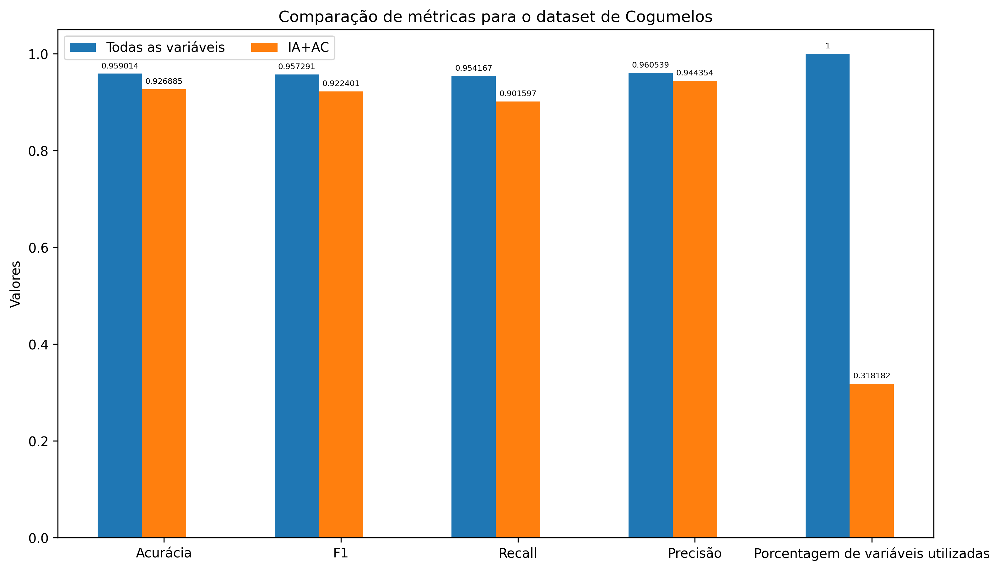

<strong>Seleção de Variáveis a partir de algoritmo genético multi-objetivo</strong>
========================================

## 1. Apresentação

Este projeto surgiu à partir de um projeto de graduação na matéria "Tópicos em Computação Bioinspirada", ministrada pelo professor Eduardo Spinosa na Universidade Federal do Paraná, no início de 2023, e majoritariamente inspirado pelos artigos **Venkatadri.M and Rao.K, S. (2010). A multiobjective genetic algorithm for feature selection in data mining** e **Yu, L. and Liu, H. (2003). Feature selection for high-dimensional data: A fast correlation-based filter solution.**

O objetivo deste trabalho é avaliar o impacto da seleção de variáveis em uma abordagem estatística independente de classificador, juntamente com um olhar minucioso sobre cada uma das métricas escolhidas e como minimizar as variáveis impacta o modelo geral. Ao contrário do que pode-se pensar, a análise aqui não tem o objetivo de maximizar a acurácia, a precisão ou escolher o melhor modelo, mas preocupa-se muito mais em analisar o processo e se a base teórica é comprovada ou não através de experimentos empíricos.

<br>

## 2. Estrutura do projeto:

- **datasets**: contém os arquivos de dados avaliados nos experimentos.

- **libs**: contém arquivos .py que possuem funçõesu tilizadas no programa principal.

- **enviroment.yml**: arquivo que descreve a versão do python e das bibliotecas utilizadas. Tal arquivo foi gerado pelo anaconda. Para estabelecer o ambiente, rode:

```bash
conda env create -f environment.yml
```

- **main.py**: arquivo principal que realiza os experimentos.

## 3. Algoritmos genéticos:

Algoritmos genéticos utilizam de populações para desenvolver, durante uma iteração, uma evolução de sua população atual. Ao contrário dos populares algoritmos de otimização que desenvolvem informações de gradiente no processo de busca a cada solução testada, o algoritmo genético testa várias soluções em um processo de busca direto, utilizando operadores estocásticos, e não os determinísticos tradicionais da otimização.

O funcionamento básico de um algoritmo genético consiste em iniciar uma população aleatória dentro dos limites predefinidos, evaluar a qualidade da solução através da função de avaliação de performance escolhida, e, com base nessa pontuação, atribuir uma probabilidade de escolha dessas soluções para o cruzamento. Importante ressaltar que não necessariamente as melhores soluções serão escolhidas para o cruzamento, embora isso possa ser garantido de alguma forma utilizando estratégias de elitismo (algumas radicalizações de tal estratégia fazem até mesmo as melhores soluções progredirem para a próxima população), mas tem mais chance, balanceando assim a exploração local e a global

## 4. Algoritmos genéticos multi-objetivo:

Uma aproximação multi-objetivo de algoritmos genéticos envolve a inclusão de mais de uma função objetivo a ser maximizada ou minimizada. Vale ressaltar que isso não limita as funções objetivo de um certo problema todas serem de maximização ou minimização - neste próprio trabalho, conforme explorado mais pra frente, há momentos em que funções para serem maximizadas e minimizadas são usadas. 

No caso da otimização multi-objetivo as funções objetivos constroem um espaço multi-dimensional chamado espaço objetivo, onde há uma projeção de cada solução neste espaço objetivo.

## 5. Fronteira de Pareto:

Num problema de otimização multi-objetivo, as soluções ótimas (afinal, um problema de otimização pode ter nenhuma, uma, várias ou infinitas soluções), são aquelas que são as primeiras numa ordenação parcial. Para que se entenda isso, deve-se utilizar o noção de dominância entre soluções. A definição de dominância se dá que uma solução $x\_{1}$ domina $x\_{2}$ se $x\_{1}$ não é pior que $x\_{2}$ em todos os objetivos e é melhor que $x\_{2}$ em pelo menos um objetivo. Quando não se há soluções que dominam x, x é uma solução não-dominada. O conjunto de soluções não dominadas são chamados de fronteira não-dominada. As projeções pertencentes a fronteira não-dominada são boas em um objetivo, mas podem ser pior que outras em determinados objetivos: essa troca entre os pontos não-dominados fazem os algoritmos se interessarem em encontrar uma variedade da soluções antes de tomar uma decisão final.

Os pontos não dominados por nenhuma solução no espaço objetivo são os pontos ótimos de pareto, enquanto o vetor de variáveis que projetam tais pontos são chamadas de soluções ótimas de Pareto. O objetivo dos algoritmos multi-objetivos, são, portanto, encontrar o máximo de pontos ótimos de pareto, para que algum algoritmo de decisão escolha a solução com o melhor balanceamento entre os objetivos.

## 6. NSGA-II:

Em Abril de 2002 foi proposto a evolução do nondominated sorting genetic algorithm (algoritmo genético de ordenção não-dominada), o NSGA-II, que hoje em dia conta com 35800 citações(Connected Papers, acesso em 07/02/2023). Tendo populaçoes de tamanho N, o NSGA-II recombina tal população numa população de tamanho 2N e a ordena baseado no ranking da fronteira de pareto, priorizando soluções da fronteira classe 1 e completando com as fronteiras subsequentes, e o desempate de soluções na mesma classe de fronteira se dá por um operador chamado _crowd distance_, que consegue cobrir a maior quantia do espaço amostral daquela fronteira de Pareto.

## 7. Funções objetivos:

As seguintes funções objetivos foram selecionadas para serem testadas em pares, se baseando nos artigos referidos no início do texto:

### 7.1. Distância Intra-Classe (IA):

A distância intra-classe denota a concentração de cada classe, ou seja, quanto menor ela é, mais próximos os exemplos de cada classe estão, portanto, é uma métrica que desejamos minimizar.

Sua fórmula é dada por:


$IA = \frac{1}{n}\sum\_{r=1}^{k}\sum\_{j=1}^{n\_{r}}d(p^{r}\_{j}, p\_{r})$

Onde n é o número de amostras, r o número de amostras de uma classe, k as classes, com $p\_{j}^{r}$ sendo o j-ésimo exemplo da classe r, com $p\_{r}$ sendo o exemplo central da classe, e d a distancia euclidiana.

### 7.2. Distância Inter-Classe (IE):

A Distância Inter-Classe indica a distância entre os exemplos que não são da mesma classe, ou seja, queremos maximizar esta distância o máximo possível, para que seja mais fácil para um modelo distinguir os exemplos. A expressão matemática desta métrica é:


$IE = \frac{1}{n}\sum\_{r=1}^{k}n\_{r}d(p\_{r}, p)$

Em que n é o número de amostras, r o número de amostras de uma classe, k a quantia de classes, com $p\_{r}$ sendo o exemplo central da classe, e d a distancia euclidiana.

### 7.3. Pontuação LaPlaciana (LS):

A pontuação LaPlaciana parte da ideia que, em problemas de classificação, exemplos da mesma classe estão relativamente próximos uns dos outros e é estraída a partir de um grafo LaPlaciano. Sua expressão matemática é a seguinte:

$LS(i) = \frac{\widetilde{x}(i)^{T}L\widetilde{x}(i)}{\widetilde{x}(i)^{T} D\widetilde{x}(i)}$

$\widetilde{x} = x(i) - \frac{x(i)^{T} D1}{1^{T}D1}$

Onde L é o grafo LaPlaciano, x(i) uma matriz $n * 1$ $x(i) = [x1(i), x2(i),..,x\_{n}(i)]^{T}$ e $1 = [1,...,1]^{T}$ e as matrizes D e L são definidas como D = diag(S1), com diag sendo um operador que extrai a diagonal de uma matriz, e L = D - S, sendo S a matriz que conecta os vizinhos mais próximos do grafo.

### 7.4. Correlação de Atributos de Classe (AC):

A correlação de atributos de classe mede a chance de se prever o valor de um atributo baseado no valor de outro, medindo a redundância nos dados. Portanto, queremos minimizá-la. Sua expressão matemática é a seguinte:

$AC = (\sum Wi\*C(i))/\sum(Wi)$

$C(i) = \frac{\sum\_{j\_{1} \neq j\_{2}} || x\_{j1}(i) - x\_{j2}(i) || f( x\_{j1}, x\_{j2})}{n(n-1)/2}$

Sendo $x\_{j}(i)$ o valor de um atributo i no exemplo j, com n o número de exemplo e m o número de atributos, com i de 1 a m e j de 1 a n, com $||$    $||$ denotando a função módulo, com $\varphi$ sendo 1 se $j\_{1}$ e $j\_{2}$ são da mesma classe e 0.05 caso contrário. O vetor de pesos w(i) assume o valor 0 se o atributo i não está selecionado, e 1 caso contrário.

### 7.5. Incerteza Simétrica (SU):

ormalizando os valores dos atributos, podemos ver se um atributo é independente de outro: o valor 1 indica dependência direta e 0 independência. Uma vez que queremos maximizar o uso de variáveis independentes, queremos minimizar a incerteza simétrica. A expressão é a seguinte:

$SU(X\_{1}, X\_{2}) = 2[\frac{H(X\_{1}) - H(X\_{1}|X\_{2})}{H(X\_{1}) + H(X\_{2})}]$

Sendo H a função que calcula a entropia, ou seja, o ganho de informação, onde $X\_{1}$ e $X\_{2}$ são atributos distintos.

## 8. Hiperparâmetros e afins:

Para a realização dos experimentos, foi utilizada a implementação do NSGA-II disponível no framework [pymoo](https://pymoo.org/), replicando as condições dos experimentos do artigo de Vendakari, ou seja:

- População de 50 indivíduos;
- Taxa de cruzamento de 0.8;
- Taxa de mutação de 0.01;
- e parada após 50 iterações.

Além disso, para configuração do framework, foi usado:

- Crossover de dois pontos;
- Mutação de Flip de bit;
- Multiplicação das métricas para maxizimar por -1, pois por padrão o framework permite apenas minimização.

E o classificador utilizado, ao contrário do artigo que utiliza uma árvore de decisão, foi a regressão logística.

## 9. Datasets:

Os [dados de sonar](https://archive.ics.uci.edu/dataset/151/connectionist+bench+sonar+mines+vs+rocks) são um problema de classificação binária disponível no UCI com 208 amostras e 60 atributos e foi utilizado no artigo de inspiração para este trabalho. A motivação para o uso de tal conjunto foi para comparar os resultados utilizando o modelo de regressão logística com o modelo utilizando o J48 do trabalho anterior, que é um modelo de árvore que também possui um mecanismo de seleção de atributos dentro dele não explorado pelos autores.

O [dataset de cogumelos](https://archive.ics.uci.edu/dataset/73/mushroom) também foi extraído da UCI e é dividido em duas classes: comestíveis e venenosos. Porém, em contraste com a tarefa do sonar, ele possui apenas 22 atributos e 8124 amostras, com todos os dados categóricos (o que não é problema, já que a regressão logística consegue lidar com dados tanto categóricos quanto contínuos e discretos).

## 10. Resultados:

Os resultados, para mim particularmente, foram surpreendentes. Enquanto no experimento realizado na matéria da faculdade o único classificador utilizado foi uma simples regressão logística -  fazendo com que alguns métodos (utilizando a distância inter-classe e a pontuação LaPlaciana, por exemplo) superassem a acurácia com todas as variáveis - neste experimento o GridSearch foi utilizado e, quando usado, esta ferramenta de busca pelo melhor classificador acaba por comportar melhor todas as variáveis ao invés de apenas os selecionados pelos métodos utilizados, evidenciando que o resultado final é influenciado tanto pelo método de classificação quanto pelas variáveis selecionadas. Abaixo, os gráficos mostram a acurácia em relação a cada par de métricas, em comparação com o uso de todas as variáveis.  


No caso do dataset do sonar, nenhum método supera ou se equipara ao uso de todas as 60 variáveis disponíveis, sendo o par de métricas de seleção com taxa de acerto mais próxima a Distância Inter-Classe com a Correlação de Atributos de Classe, atingindo o valor de 0.745, enquanto o uso de todas as variáveis resulta em uma acurácia de 0.779. O gráfico abaixo compara o uso de todas as variáveis e o par IE+AC em relação a diferentes métricas.



Com exceção do recall, em que o par de métricas atinge 0.68 e o uso completo das variáveis próximo de 0.74, todas as métricas possuem valores bem próximos, o que é impressionante se considerar a redução de 86% das variáveis utilizadas no caso em que são selecionadas. Embora o teto de variáveis nesse caso seja 60, ainda um número pequeno considerando os data streams de hoje em dia, uma redução pequena nas métricas observadas em troca de uma drástica redução da proporção de variáveis pode ser bem vinda quando há muitas variáveis na base de dados. 

Já no caso do dataset de sonar, é curioso como em alguns casos (IE+LS, AC+LS e SU+LS) todas as 22 variáveis foram mantidas, seja porque o número é pequeno então foi sempre mantido durante as gerações do NSGA-II ou outro motivo. Com exceção destes, o par de métricas para seleção de variáveis que chegou mais próximo foi o da Distância Intra-Classe com a Correlação de Atributos de Classe, atingindo 0.92 de acurácia. O gráfico abaixo compara o par IA+AC com o uso de todos os atributos em diversas métricas. 



Assim como no caso do sonar, o melhor par de métricas para otimização que reduz as variáveis significativamente (aqui há uma redução de 68% das variáveis utilizadas) chega próximo do uso completo das variáveis em todas as métricas. 

## 11. Conclusão e experimentos futuros:

Seleção de variáveis ainda é um tópico relevante nos dias de hoje, já que a quantidade de dados gerados cresce exponencialmente. Aqui, o NSGA-II com métricas estatísticas em pares mostrou, a depender do caso, reduzir as variáveis significativamente em troca de uma pequena perda nas taxas de acerto e positivos e negativos corretos, algo que é muito valorizado em alguns problemas de otimização ou até mesmo no caso de aprendizagem profunda (como exemplo, a MobileNet). Ainda assim, alguns materiais dizem que a seleção de variáveis podem até mesmo aumentar as pontuações, algo que não foi atingido neste trabalho. 

Ainda há outros métodos e métricas a se comparar, e não só isso. Embora a abordagem deste trabalho sobre a seleção de variáveis seja a chamada filter, em que o classificador não é levado em consideração para seleção, os melhores resultados tem sido em abordagens wrapper, em que o classificador faz parte do mecanismo de seleção de variáveis, sendo a métrica escolhida (acurácia ou recall, por exemplo) a função a ser, neste caso, maximizada, algo que pode ser feito utilizando o NSGA-II ou outros algoritmos. Outro acréscimo seria utilizar as métricas em trios ao invés de pares, ou, ao invés de incluir uma terceira métrica, incluir a minimização das variáveis utilizadas.
